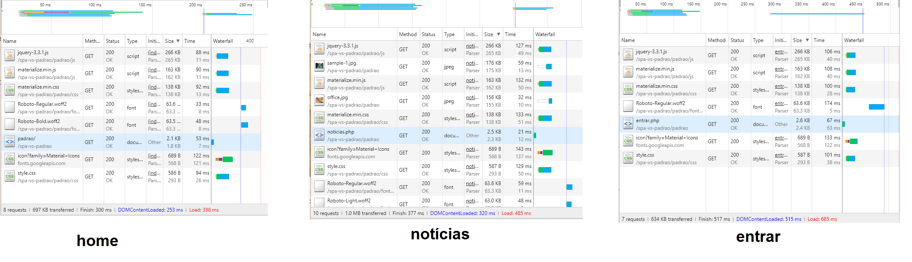
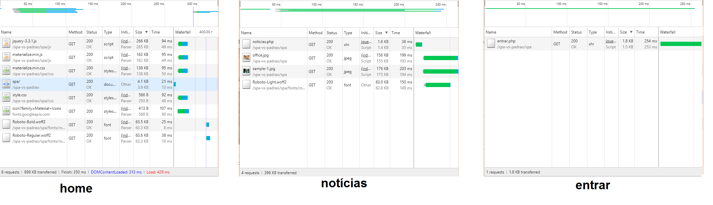

# spa-vs-padrao
Comparação entre SPA e um arquitetura convecional.

## Como usar

Clone o projeto para dentro da pasta do seu servidor.
```
git clone https://github.com/KrishnaXavier/spa-vs-padrao.git
```

Execute seu servidor (WAMP, LAMP, XAMPP etc).

Abra a pasta do projeto no seu localhost.

Exemplo: http://localhost/spa-vs-padrao/

Use as ferramentas de desenvolvedor do navegador para ver o fluxo de dados nas arquiteturas.

Exemplo arquitetura padrão:



Exemplo arquitetura SPA:


